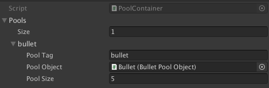

# Unity Object Pool


Simple object pooling system created for Unity. In repository you can find demo scene with simple example.

## Setup

Create own script inheriting from `BasePoolObject` for object which you want use in pool. 
This `BasePoolObject` script provide 3 methods:
- OnCreate - called once when object is created in `ObjectPooler`. You can override this method but you had to keep the base invocation.
- OnSpawn - called every time when you get object from pool
- OnReturn - called every time when you return object to pool

When you create your objects for pool, save them as a prefab, and create `PoolContainer`. This is scriptable object asset and you can create it from create menu.


After this drag and drop PoolContainer into `ObjectPooler` script on scene.


In `PoolContainer` you can create many pools.



Each pool have three fields:
- PoolTag - this is tag which you need to get object from pool
- PoolObject - prefab with script inheriting from `BasePoolObject`
- PoolSize - how many object will by Instantiate on start

## Usage

To get object from pool or return it. You need to call method from ObjectPooler script. In this repository this script if singletone but you can change it if you wish.

### GetFromPool


```cs
public BasePoolObject GetFromPool(string poolTag, Vectro3 position, Quaternion rotation, Transform parent);
```

#### Example

```cs
ObjectPooler.Instance.GetFromPool(PoolTagHelper.BulletTag, transform.position, transform.rotation, null);
```

### ReturnToPool

```cs
public void ReturnToPool(BasePoolObject basePoolObject)
```

#### Example

```cs
ObjectPooler.Instance.GetFromPool(PoolTagHelper.BulletTag, transform.position, transform.rotation, null);
```